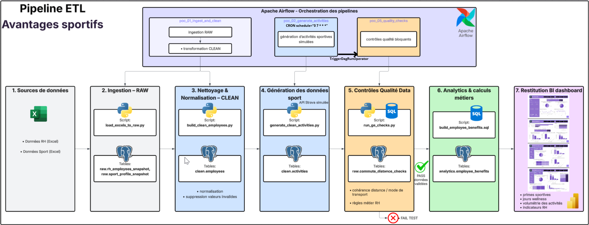
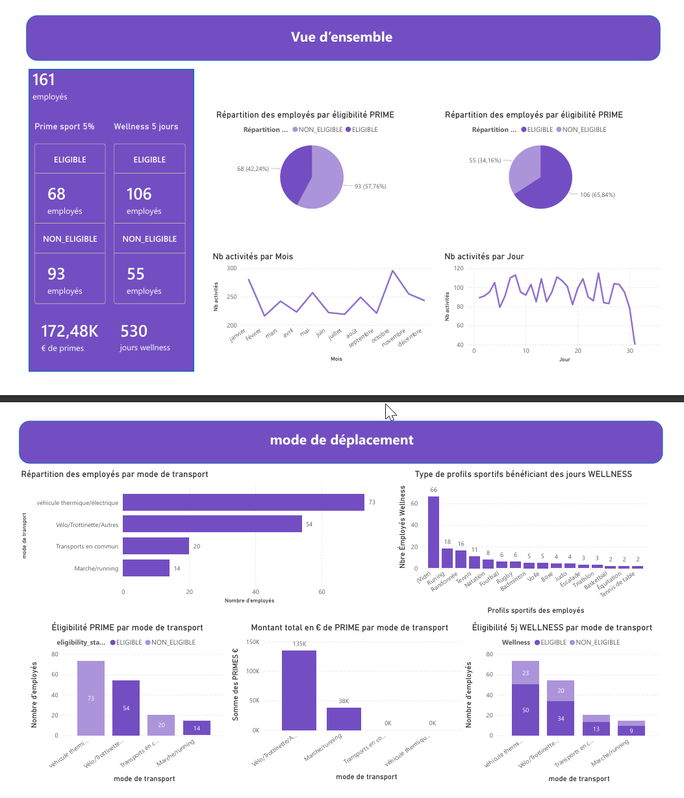

#  Créer et automatiser une infrastructure de données

##  Contexte du projet

Dans le cadre de ce projet, l’objectif est de concevoir et automatiser une **infrastructure de données moderne** permettant d’analyser les pratiques sportives des employés d’une entreprise, afin de calculer des **avantages sociaux liés au sport** (primes sportives, jours wellness, indicateurs RH)..

Le projet est réalisé sous forme de **POC (Proof of Concept)**, avec une architecture automatisée, reproductible et monitorée, conforme aux bonnes pratiques Data Engineer.

---

## Périmètre fonctionnel du POC

Le périmètre du projet couvre les axes suivants :

1. **Ingestion de données multi-sources (Excel)**
2. **Nettoyage et normalisation des données**
3. **Génération de données sportives simulées (type API Strava)**
4. **Contrôles de qualité de données et règles métier bloquantes**
5. **Calculs métiers et agrégation analytique**
6. **Restitution des résultats via Power BI**

---

##  Architecture technique
<p align="center">
  
  <br>
  <em>Vue d’ensemble du pipeline ETL orchestré avec Apache Airflow</em>
</p>
###  Composants principaux, stack utilisée

- **Docker / Docker Compose** : orchestration des services
- **PostgreSQL** : base de données relationnelle
- **Apache Airflow** : orchestration des pipelines de données
- **Python** : ingestion, transformations, contrôles qualité
- **SQL** : transformations, règles métier et et calculs analytiques
- **Power BI** : visualisation et reporting

---

##  Modélisation des données

### Schémas PostgreSQL

- `raw` : données brutes (ingestion)
- `clean` : données nettoyées et normalisées
- `analytics` : tables prêtes pour la BI
- `meta` : paramètres métiers et suivi d’exécution

### Exemples de tables clés

- `raw.commute_distance_checks`
- `clean.employees`
- `clean.activities`
- `analytics.employee_benefits`

---

## Pipelines de données (ETL)

Les pipelines sont orchestrés par **Apache Airflow**.

### DAG `poc_01_ingest_and_clean`

- Ingestion des fichiers Excel RH et Sport
- Chargement dans la couche `raw`
- Nettoyage et normalisation vers la couche `clean`
- Pipeline **idempotent** et rejouable

### DAG `poc_02_generate_activities`

- Génération automatique d’activités sportives
- Simulation d’une API de type Strava
- Alimentation de la table `clean.activities`
- **Planification via CRON** : exécution quotidienne (`0 7 * * *`)
- Ce DAG produit un nouveau lot de données sportives de manière automatique

### DAG `poc_05_quality_checks`

- Exécution de contrôles qualité bloquants
- Vérification des règles de cohérence et métier
- **DAG non planifié volontairement**
- Déclenché automatiquement via un **TriggerDagRunOperator** à la fin du DAG `poc_02_generate_activities`
- Joue le rôle de **garde-fou qualité** avant les calculs métiers

### Chaînage des DAGs

Le pipeline est chaîné de la manière suivante :
```
poc_02_generate_activities (CRON)
↓
TriggerDagRunOperator
↓
poc_05_quality_checks (contrôles qualité)
```
---

##  Tests de qualité des données

###  Tests de cohérence
- Valeurs non nulles sur les champs critiques
- Unicité des identifiants (`employee_id`, `activity_id`)
- Valeurs positives (distances, durées, salaires)
- Validité des dates (`end_ts >= start_ts`)

### 📐 Tests de règles métier

Règle de cohérence domicile–travail selon le mode de transport :

| Mode de transport           | Distance maximale autorisée |
|-----------------------------|-----------------------------|
| Marche / Running            | ≤ 15 km                     |
| Vélo / Trottinette / Autres | ≤ 25 km                     |

Toute distance dépassant ces seuils est considérée comme **anormale**.

---

##  Démonstration des tests (FAIL → PASS)

Afin de démontrer le bon fonctionnement des règles métier :

1. **Injection de données mockées** (distances incohérentes)
2. Exécution du DAG `poc_05_quality_checks` → **FAIL**
3. Correction des données mockées
4. Nouvelle exécution du DAG → **PASS**

Scripts SQL utilisés :
- `src/db/mock_commute_distance_fail.sql`
- `src/db/mock_commute_distance_fix.sql`

Cette approche permet de démontrer :
- la détection automatique des anomalies
- la traçabilité des erreurs
- la robustesse du pipeline

---

##  Monitoring du pipeline

Le monitoring est assuré par :

- **Airflow UI** :
  - statut des DAGs (SUCCESS / FAILED)
  - logs détaillés par tâche
- **Contrôles de volumétrie** :
  - seuil minimal de lignes attendu
  - détection de ruptures de flux
- **Logs SQL et Python** :
  - remontée des anomalies métier

---

##  Restitution des résultats (Power BI)
<p align="center">
  
  <br>
  <em>Vue d’ensemble du dashboard PowerBI</em>
</p>
Les données consolidées dans le schéma `analytics` permettent de visualiser :

- Nombre de jours supplémentaires attribués
- Répartition des pratiques sportives
- Coûts estimés des avantages
- Volumétrie d’activités par période
- Détection des anomalies de déclaration

Power BI est utilisé comme outil de restitution final.

---

##  Choix techniques et bonnes pratiques

- Architecture modulaire et extensible
- Pipelines idempotents
- Séparation claire des couches de données
- Tests qualité automatisés et bloquants
- Tolérance aux sources absentes (POC)
- Documentation claire et reproductibilité

---

## Conclusion

Ce projet démontre la capacité à :
- concevoir une infrastructure de données complète
- automatiser des flux ETL fiables
- implémenter des règles métier robustes
- monitorer et sécuriser la qualité des données
- produire des indicateurs exploitables pour la prise de décision

Il constitue une base solide pour une mise en production future.
